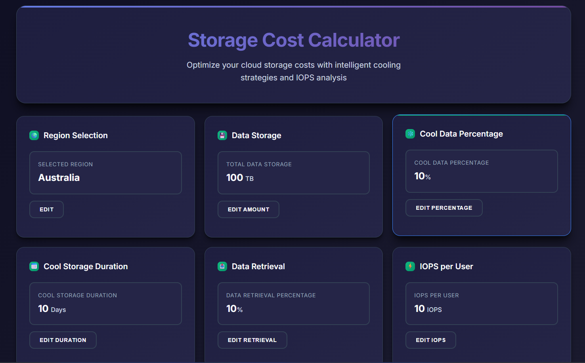
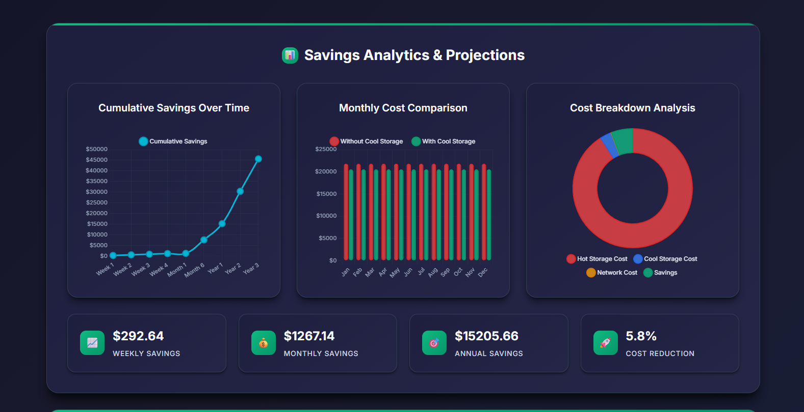
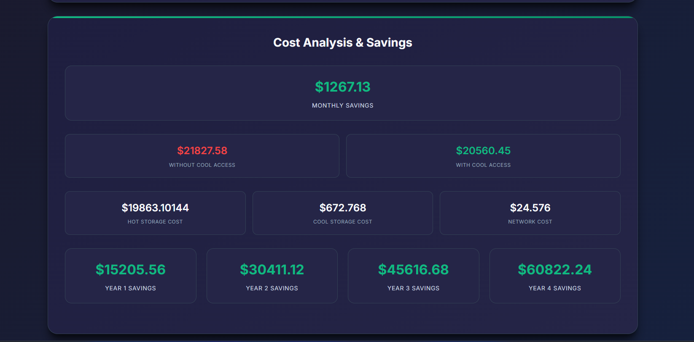

# Cool Storage Cost Saving with IOPS Calculator

Optimizing cloud storage costs while ensuring adequate performance is a critical challenge for businesses. This project presents a React-based "Cool Storage Cost Saving with IOPS Calculator" tool designed to help users make informed decisions about their data center storage strategies. By providing real-time cost comparisons and tailored IOPS subscription recommendations across various Azure storage options, this tool empowers users to optimize data center IOPS and identify significant cooling access cost savings across different geographical regions.

Whether you're managing a 100 TB dataset in Australia and aiming to save $126 monthly ($1,520 annually), or handling a scenario with 1,000 users each requiring 100 IOPS, this calculator helps visualize potential savings and select the most suitable storage tier.

## Table of Content
1. [Features](#features)
2. [Screenshots](#screenshots)
3. [Installing and Running](#installing-and-running)

## Features

* **Real-time Cost Comparison:** Instantly view the difference in monthly and annual costs with and without "cool access" storage options.
* **Regional Cost Analysis:** Calculate cost savings for various Azure regions (e.g., Australia, US, Europe, Asia, etc.), accounting for regional pricing variations.
* **Tailored IOPS Recommendations:** Receive personalized IOPS subscription suggestions based on your data size, user count, and per-user IOPS requirements.
* **Multiple Storage Options:** Compare costs and performance across 5 distinct Azure storage options:
    * **Standard Storage**
    * **Premium Storage**
    * **Ultra ANF (Azure NetApp Files)**
    * **Azure Files**
    * **Azure Files Premium**
* **Scalability Scenarios:** Handle complex scenarios, such as calculating costs for a large number of users with specific IOPS demands (e.g., 1,000 users each needing 100 IOPS).
* **Intuitive User Interface:** A user-friendly interface makes it easy to input parameters and understand the results.

## Screenshots

|                    IOPS                    |                      Graphs                      |                    Saving                     |
| :---------------------------------------------: | :------------------------------------------------------: | :----------------------------------------------: |
|  |  |  |

## Installing and Running

```
git clone https://github.com/PraveenUppar/Cloud-Acces-Price-Tracker.git
```
```
npm install
```
```
npm start
```
